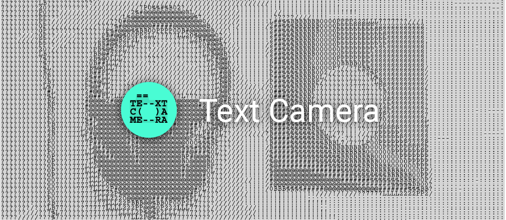

An Android camera app that translates camera footage to a matrix of text characters, by matching
grayscale values to an array of pre-determined text characters.

The app supports taking photos with a long press anywhere on the screen. 

# Demo
The animation below gives an example of what the app looks like.   

  
